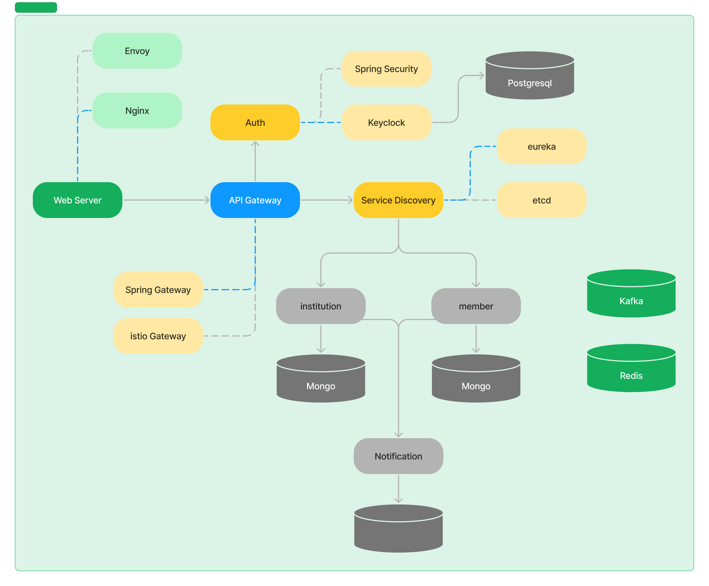

# Toy Project
[](https://codecov.io/gh/hankk20/kindernoti)
### 유치원 및 학교 알림장을 구현
## 📐 System Architecture

## 📑 서비스 목록
### [인증/회원 서비스](services/member/README.md)
- Oauth, ID/PW 로그인 기능
- 통합 회원 정보 관리
### [교직원 서비스](services/institution/README.md)
### 학부모 서비스
### 알림 서비스
## 🛠 Tech
### Architecture
  

### Language & Framework
    

### Infrastructure & Persistence
     

### Documentation
 

## 📖 Article 
### Spring
- [Webflux에서 @TransactionEventListner기 동작 하지 않는다.(Spring Framework 6.0 이하)](https://hankk.notion.site/Webflux-TransactionEventListner-0ca73e8372a0433cb5e820fcf4f25f02?pvs=4)
- [Spring에서 Reactive Kafka Producer/Consumer 사용](https://hankk.notion.site/Spring-Reactive-Kafka-Producer-Consumer-5db7fa1be187491fae43682e22480b1d?pvs=4)
- [RestDoc API 문서 작성 With Epages](https://hankk.notion.site/RestDoc-With-OpenAPI-3-0-f719be4c3d4d43cca146a5856c46513a?pvs=4)
- [Spring에서 MonogDB, Webflux Test 관련 이슈](https://hankk.notion.site/6f5b5b70317340c88cd74258675cf1bd?pvs=4)
- [Jsoe 라이브러리를 사용하여 JWK 구성](https://hankk.notion.site/51663f3637c84362b3f4abfc94509eab?pvs=4)
- [Spring Security + Keycloak 설정](https://hankk.notion.site/Spring-Security-211460de74754317b769a4af6f1d4983?pvs=4)
- [Keycloak 로그인 페이지를 우회하여 Oauth2 로그인 처리](https://hankk.notion.site/Keycloak-Oauth2-fc5a04f399cb40378acb7806978e9be6?pvs=4)

### Architecture
- [Rest API에서 값 업데이트(Json Patch, Json Merge Patch)](https://hankk.notion.site/Json-Patch-Json-Merge-Patch-46e8a37c8ca941d0931785f5de280eb3?pvs=4)
- [Entity의 Id는 어디서 생성 해야 되나](https://hankk.notion.site/Entity-ID-21ec1bd2b9ec4a3a86fbef913d041ccb?pvs=4)

### Infra
- [Mongodb SingleNode ReflicaSet 구성](https://hankk.notion.site/Mongo-Single-Node-Replica-Set-76ebf73b32a840429d86ba3731fd107a?pvs=4)
- [Gradle 중앙버전관리 및 Build Convention 설정](https://hankk.notion.site/Version-Catalog-Build-Convention-8df25b53b44e4ec499554a05ef255fa7?pvs=4)
- [MongoDB + QueryDsl 설정](https://hankk.notion.site/QueryDsl-f8038fc9509a4e64aa5d7054676e5f39?pvs=4)
## ⚙ 설정
### hosts
```text
127.0.0.1 kindernoti.co.kr
127.0.0.1 auth.kindernoti.co.kr
```
### 암호회된 속성
암호화된 속성은 그대로 사용 할 수 없고 Config Server를 통해 사용할 값을 암호화 해서 속성을 수정 해야함
/config-repo/application.yml
```yaml
 app:
  eureka-username: '{cipher}10cf812e5eff....'
  eureka-password: '{cipher}2d49089151345f6285f3bfad814d...'
```
/config-repo/institution-service.yml
```yaml
 external:
  api:
    neis: '{cipher}9e4ae87cc42fc3e07da0bca0cccb396ecb7ff354....'
    kindergaten: '{cipher}c6a6fa61fc2cf5a1d76d87e9....'
```
암호화 방법
```shell
./gradlew :spring-cloud:config-server:bootRun --args='--spring.profiles.active=native \
 --spring.security.user.name=configuser \
 --spring.security.user.password=1111 \
 --encrypt.key=testkey'
```
```shell
curl localhost:8888/encrypt -u "configuser:1111" -s -d mysecret
```
### .env 설정
```dotenv
CONFIG_SERVER_ENCRYPT_KEY=testKey
CONFIG_SERVER_USR=configuser
CONFIG_SERVER_PWD=configpwd
```
### Build, Start Up
```shell
./gradlew bootJar
```
```shell
docker-compose up -d --build
```
> http://kindernoti.co.kr/swagger
## Todo
- codecov 적용 : 2023-10-17
- 인증서버 Keycloak으로 대체 : 2024-02-01 
- 권한처리 세분화
- 로그 수집
