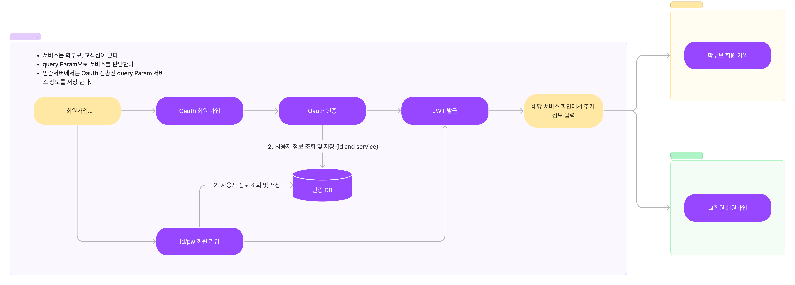

# 인증 서비스


## Oauth 인증 (kakao, naver, google)
OIDC 제공하는 Provider가 있으면 OIDC를 사용 한다.

## 로그인 인증
인증서비스는 기본 정보만 관리한다.
```mongodb-json
{
  "id": ObjectId,
  "password": string,
  "user_id": string,
  "email" : string,
  "oauthProvider": string,
  "serviceType": [string]
}
//OauthProvider Oauth 회원 인경우 Provider 정보
//serviceType 학부모(parent) 교직원 구분(teacher)
```
