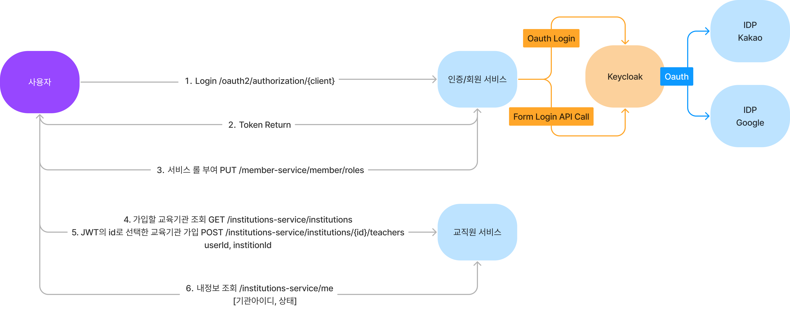

# 인증/회원 서비스

## 인증
- 인증/회원 Multi Security 설정
  - [SecurityConfig](./src/main/java/kr/co/kindernoti/member/infrastructure/spring/security/SecurityConfig.java) 
### Oauth2
- Keycloak에 IDP를 등록하고 서버에서 Keycloak 서버로 Oauth2 로그인 요청을 보낸다.
  - [KeycloakOauth2AuthorizationRequestResolver](./src/main/java/kr/co/kindernoti/member/infrastructure/spring/security/KeycloakOauth2AuthorizationRequestResolver.java)
### Form Login ID/PW
- Keycloak Admin API를 통해 ID/PW 기반 Token 요청
  - [KeycloakUserAuthenticationManager](./src/main/java/kr/co/kindernoti/member/infrastructure/spring/security/KeycloakUserAuthenticationManager.java)
